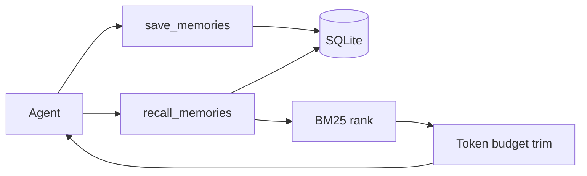

# TinyContext

[](LICENSE)


**Token-light memory for local AI agents.**

TinyContext gives MCP agents a small, self-hosted memory layer: save concise facts
and recall only the most relevant context within a token budget.

No hosted dashboard. No account system. Just save -> rank -> recall.

## Why people use it

- Add durable session memory to Cursor, Cline, Roo Code, Claude Desktop, or any MCP client.
- Keep recalled context small enough for local LLM windows.
- Store memories in a local SQLite database you control.
- Use MCP as the primary interface, with an optional HTTP API for debugging.

## Quick start

Run TinyContext as an MCP server over Streamable HTTP:

```bash
docker compose -f "https://github.com/MarcellM01/TinyContext.git#main:compose.quickstart.yaml" up -d
```

Then connect your MCP client to:

```json
{
  "mcpServers": {
    "tinycontext": {
      "url": "http://localhost:8000/mcp"
    }
  }
}
```

Stop and remove the containers later with:

```bash
docker compose -f "https://github.com/MarcellM01/TinyContext.git#main:compose.quickstart.yaml" down
```

TinyContext exposes two MCP tools:

```text
save_memories(memories, session_id?)
recall_memories(query, session_id?, max_tokens?, top_k?)
```

Typical routing:

- Use `save_memories` when the agent learns a durable fact, preference, or note.
- Use `recall_memories` before answering when prior context may help.

## How it works



## Run from source

```bash
python -m venv .venv
source .venv/bin/activate
pip install -r requirements.txt
python servers/mcp_server.py
```

For HTTP transport:

```bash
MCP_TRANSPORT=streamable-http MCP_HOST=0.0.0.0 MCP_PORT=8000 python servers/mcp_server.py
```

For the optional FastAPI server:

```bash
uvicorn servers.fastapi_server:app --host 0.0.0.0 --port 8000
```

## HTTP endpoints

| Method | Path | Purpose |
|--------|------|---------|
| GET | `/health` | Liveness |
| POST/GET | `/save_memories` | Persist one or more memories |
| POST/GET | `/recall_memories` | Retrieve ranked memories within a token budget |

### `save_memories`

Request body:

```json
{
  "session_id": "optional-session",
  "memories": [
    {
      "content": "User prefers concise answers",
      "tags": ["preference"],
      "metadata": {"source": "chat"}
    }
  ]
}
```

Response:

```json
{
  "saved": [
    {
      "id": "uuid",
      "session_id": "optional-session",
      "content_tokens": 5,
      "created_at": "2026-06-30T10:00:00Z"
    }
  ]
}
```

### `recall_memories`

Request body:

```json
{
  "query": "user preferences",
  "session_id": "optional-session",
  "max_tokens": 2000,
  "top_k": 10
}
```

Response:

```json
{
  "query": "user preferences",
  "memories": [
    {
      "id": "uuid",
      "content": "User prefers concise answers",
      "score": 1.23,
      "content_tokens": 5,
      "tags": ["preference"],
      "metadata": {"source": "chat"},
      "created_at": "2026-06-30T10:00:00Z"
    }
  ],
  "total_tokens": 5,
  "truncated": false
}
```

### Error codes

| Code | HTTP | Meaning |
|------|------|---------|
| `empty_memory` | 400 | Missing or blank memory content/query |
| `session_not_found` | 404 | No memories exist for the requested session |
| `recall_budget` | 400 | Invalid recall budget parameters |
| `internal_error` | 500 | Unexpected server error |

## Configuration

Default config lives in [`configs/context_config.json`](configs/context_config.json).

| Key | Default | Description |
|-----|---------|-------------|
| `memory_db_path` | `data/memories.db` | SQLite database path |
| `recall_top_k` | `10` | Max memories to consider |
| `recall_max_tokens` | `2000` | Default recall token budget |
| `encoding_name` | `o200k_base` | Tokenizer used for budgeting |

Environment overrides:

| Variable | Purpose |
|----------|---------|
| `TINYCONTEXT_CONFIG_PATH` | Override config JSON path |
| `TINYCONTEXT_MEMORY_DB_PATH` | Override SQLite database path |
| `TINYCONTEXT_VERSION` | API version string |
| `MCP_TRANSPORT` | `stdio`, `sse`, or `streamable-http` |
| `MCP_HOST` | MCP HTTP bind host |
| `MCP_PORT` | MCP HTTP bind port |
| `MCP_CORS_ORIGINS` | CORS origins for browser MCP clients |

## Docker

Build locally:

```bash
docker compose up -d --build
```

Optional FastAPI profile:

```bash
docker compose --profile fastapi up -d --build
```

## Tests

```bash
python -m unittest discover tests
```

## MCP client templates

Copy a template from [`mcp_templates/`](mcp_templates/) and update the absolute paths for stdio mode.

## License

MIT. See [LICENSE](LICENSE).
